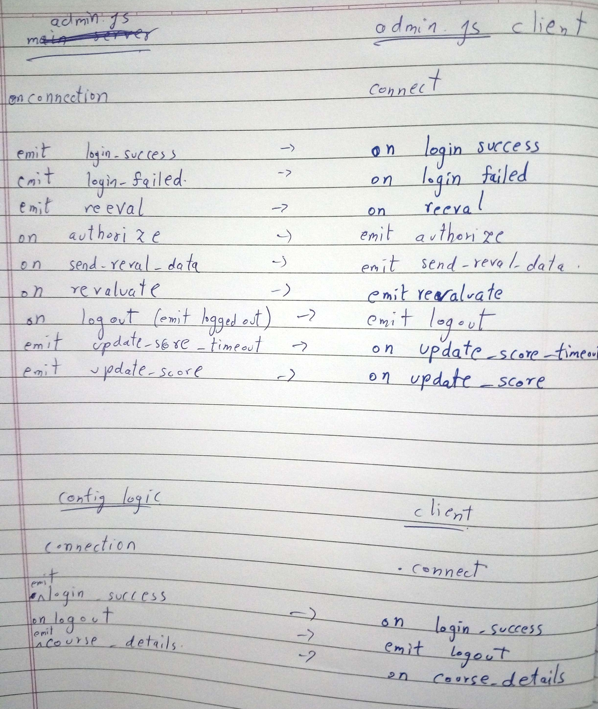
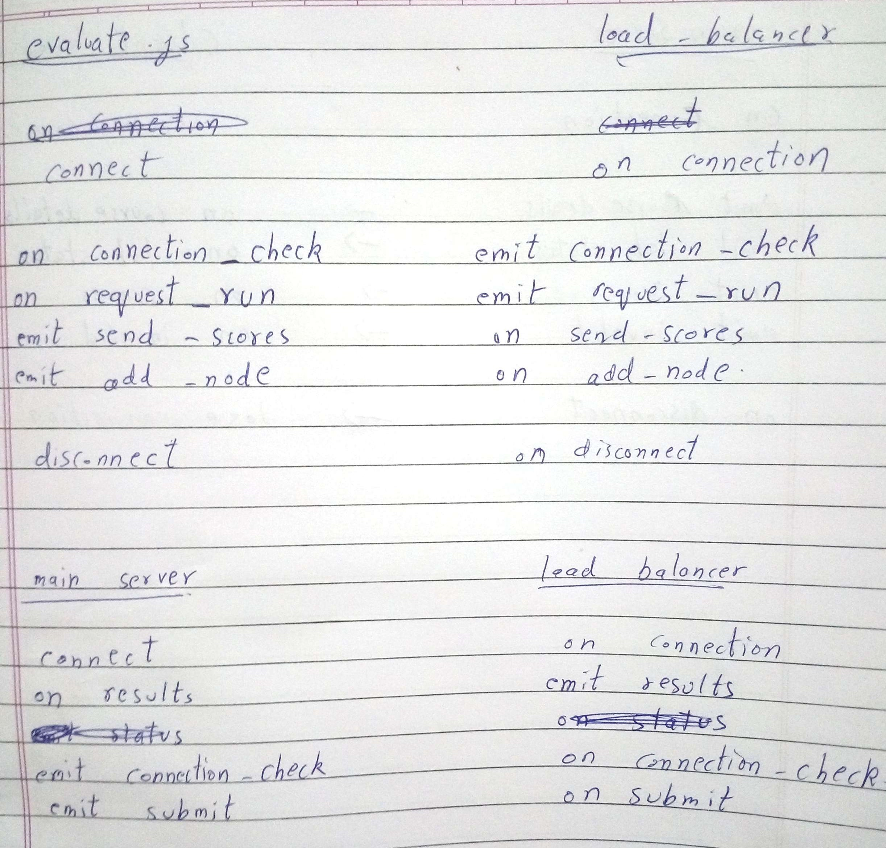
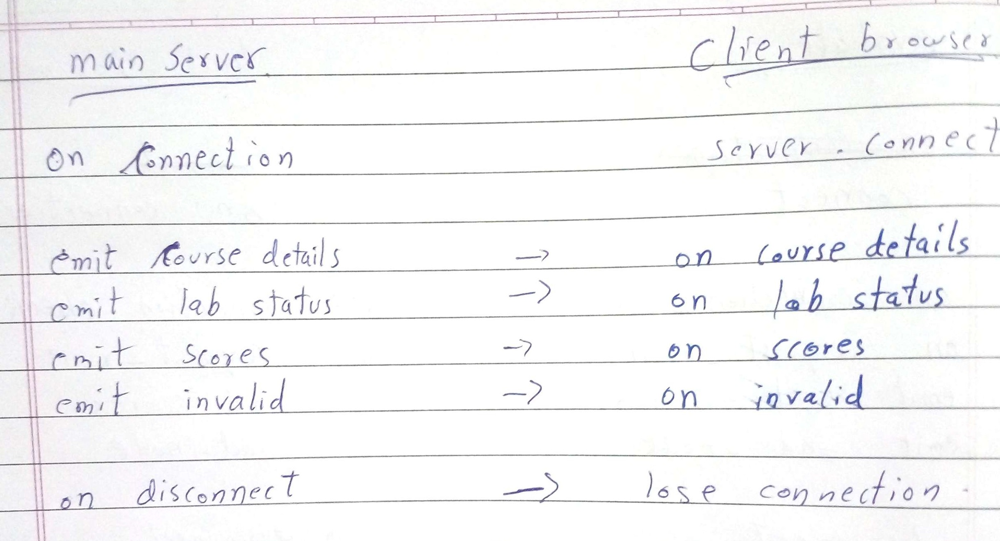

### Coding Standards ###

* Use Js closures for function level scoping.
* module private functions and objects.
* Jslint in travis pipeline.
* Use code Auto-formatter for Js.
* Use nginx for serving static html content.
* Use Main Server as pure-API.
* All commits happen through PRs.

### Overall Application ###

* Reformat travis.yml as per clinical bioportal repository.

### Main Server ###

* Removal of repeated and unused lines, along with the TESTING flags throughout the main server. 
* Check the validity of all the json files used and handle the errors(if any) suitably.
* All the functionality of the main server can be split into three parts:-
    1. A database.js to handle sql queries and responses and wrap them in functions.
    1. A labs.js to rename a lab, request a revaluation etc. and to show active status, penalty, scoreboard etc.(read from labs.json)
    1. An admin.js (already present) keeping in mind the limited access a normal user should have.
* All API calls must be converted from simplex to duplex.
* Improve Cookie Generation.
* Rename flag and other temporary variables to something which is easier to understand. 
  eg. var isValidLab
* Verify clients using proper https/ssl certificates.
* Refactoring double declaration of checkConnection request to a single function.

### Load Balancer ###

* Removal of repeated and unused lines, along with the TESTING flags throughout the load balancer.
* Modifying the use of core modules sys and exec. 
* Refactoring double declaration of checkConnection request to a single function.
* Use of ca certificates for two way verification of the https request between the client and the request responder.
* Returning of status response in json format instead of string.
* Job-id inclusion for nodes and job queues.
* All API calls must be converted from simplex to duplex.
* Allowing only configured nodes to be added via the addNode request.
* Keeping SQL connection alive 
* Refactoring start up scripts to support ansible way. 
* All the functionality of the load balancer can be split up into three parts.    
    1. Maintenance of the execution node status.
    1. interactions with the MySQL
    1. Communication with the main server and execution nodes    
    These can probably placed in three different modules.

### Execution Nodes ###

* Removal of repeated and unused lines, along with the TESTING flags throughout the execution node.
* Integrate PM2 module in place of "exec".
* Proper use of path.join.
* Replace hard-coded filenames with yaml config files.
* Use proper JSON object and function to collect request info to avoid long code and make exec-command.(41-43)
* Dump error,stderr,stdout to log file.
* Figure out use of array.pop and comment.pop extra spaces.
* Rename array variable as marks.
* Minimize temporary variables.
* Validate config files.
* Move all variable declarations to the top of the file.
* Use of lines 132-136.
* Move server listen to top.
* Handle all scenarios of response to the request.

Images for socket-io connection:

### References ###
[request](https://github.com/request/request) - Simplified HTTP request client. [tutorial](http://stackabuse.com/the-node-js-request-module/)     
[amygdala](https://github.com/lincolnloop/amygdala) - RESTful HTTP client for JavaScript powered web applications (has a good way of reusing HTTP options)    
[crossing](http://www.npmtrends.com/request-vs-crossing) - a URL forming library    
